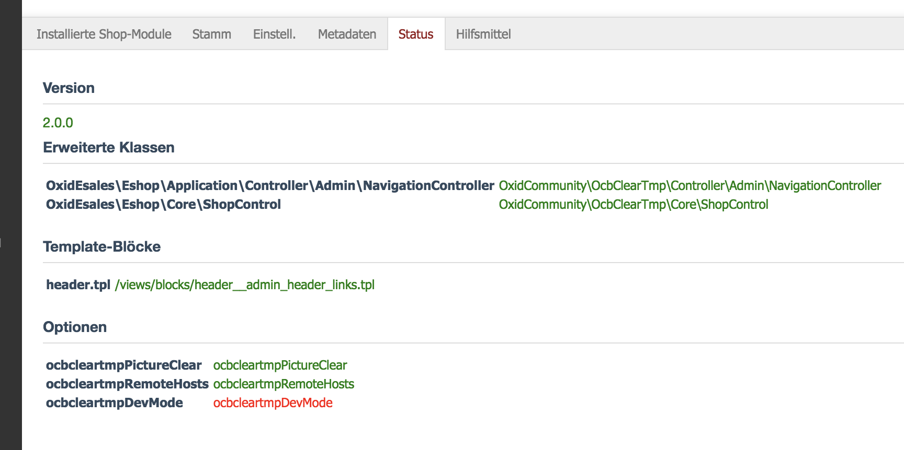

# Oxid Module Internals
Internal OXID eShop 6 module system information and troubleshooting tools.

proudly presented by [OXID Hackathon 2017](https://openspacer.org/12-oxid-community/185-oxid-hackathon-nuernberg-2017/) ;-)

Original module (for Oxid eShop 5.x/4.x) by [Alfonsas Cirtautas](https://github.com/acirtautas/oxid-module-internals).

## Features
[](https://travis-ci.org/OXIDprojects/oxid-module-internals)
[](https://app.codacy.com/app/keywan.ghadami/oxid-module-internals?utm_source=github.com&utm_medium=referral&utm_content=OXIDprojects/oxid-module-internals&utm_campaign=Badge_Grade_Settings)

 * Display highlighted metadata file content.
 * Reset module related shop cache data.
 * Toggle module activation / deactivation
 * Compare and troubleshoot metadata vs internally stores data
   * Extended classes
   * Template blocks
   * Settings
   * Registered files
   * Registered templates
   * Version
   * Events

## Installation

```
composer require oxid-community/moduleinternals
```

## Screenshot



# Changelog
* 2018-11-14  1.3.0 Show blocks, case sensitive file exist checks, support legacy class names
* 2018-11-14  1.2.1 migration support from 1.0.1
* 2018-11-14  1.2.0 support metadata v2.1
* 2018-09-13  1.1.0 add external module healthy status page
* 2017-12-15	1.0.1	namespace, docblocks
* 2017-12-09	1.0.0	module release
